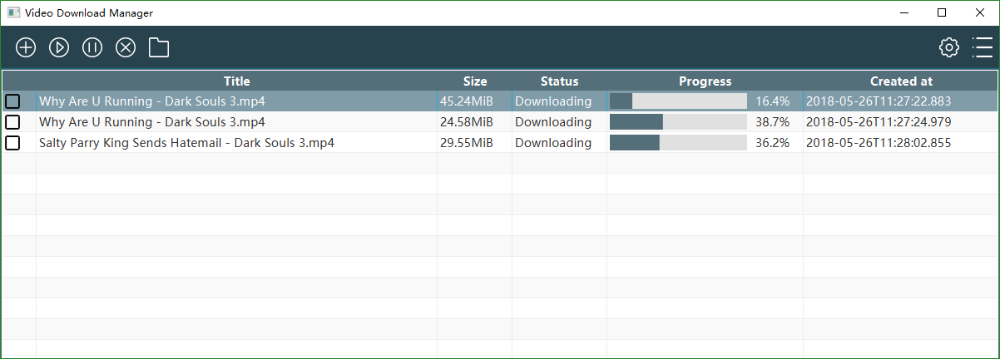
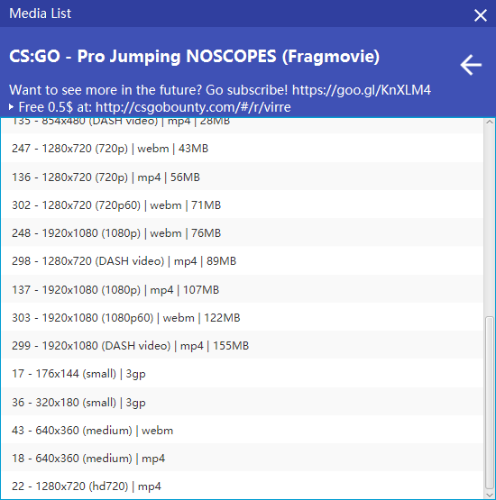
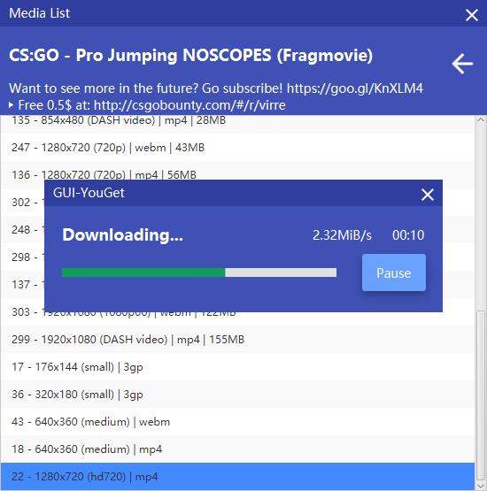

# GUI-YouGet

[中文说明](http://www.ingbyr.com/post/youget-zh/)

# Download
[Download Page](https://github.com/ingbyr/GUI-YouGet/releases)

- You can install GUI-YouGet by downloading GUI-YouGet.exe directly
- If you know how to run the jar file,  just download the `GUI-YouGet-NEEDJRE.zip`(Requires the [JRE8 ](http://www.oracle.com/technetwork/java/javase/downloads/jre8-downloads-2133155.html)or [JDK8](http://www.oracle.com/technetwork/java/javase/downloads/jdk8-downloads-2133151.html))

# Screenshots

# Feedback Bugs
If something is broken and `GUI-YouGet` can't get you things you want, don't panic. (Yes, this happens all the time!)
Open a new issue on [GitHub](https://github.com/ingbyr/GUI-YouGet/issues), with detailed `app/log/debug.log` output attached.

# Legal Issues
This software is distributed under the [MIT license](https://raw.githubusercontent.com/ingbyr/GUI-YouGet/master/LICENSE.txt).
In particular, please be aware that
> THE SOFTWARE IS PROVIDED "AS IS", WITHOUT WARRANTY OF ANY KIND, EXPRESS OR
IMPLIED, INCLUDING BUT NOT LIMITED TO THE WARRANTIES OF MERCHANTABILITY,
FITNESS FOR A PARTICULAR PURPOSE AND NONINFRINGEMENT. IN NO EVENT SHALL THE
AUTHORS OR COPYRIGHT HOLDERS BE LIABLE FOR ANY CLAIM, DAMAGES OR OTHER
LIABILITY, WHETHER IN AN ACTION OF CONTRACT, TORT OR OTHERWISE, ARISING FROM,
OUT OF OR IN CONNECTION WITH THE SOFTWARE OR THE USE OR OTHER DEALINGS IN THE
SOFTWARE.

# Contributors
- gojko71: Hungarian Language Support

# Authors
Made by [@ingbyr](http://www.ingbyr.com)
