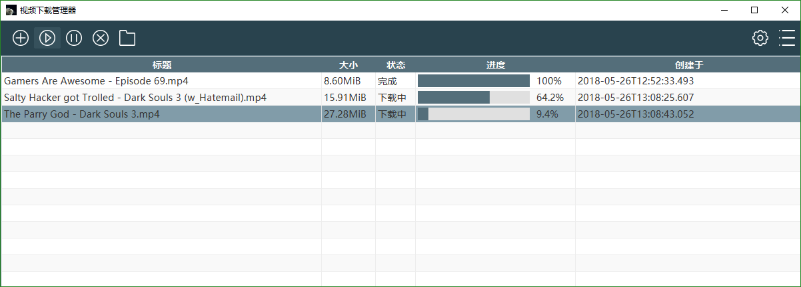

# Video Download Manager

[中文说明](http://www.ingbyr.com/post/youget-zh/)

# Download
- Install the [JRE8](http://www.oracle.com/technetwork/java/javase/downloads/jre8-downloads-2133155.html) first (If you have installed the JRE, skip this step).
- Download the [VDM.zip](https://github.com/ingbyr/VDM/releases), unzip it and then click the `VDM.jar` file

# Screenshots

# Feedback Bugs
If something is broken and `VDM` can't get you things you want, don't panic.
Open a new issue on [GitHub](https://github.com/ingbyr/VDM/issues), with detailed `%HOMEPATH%\.vdm\log\debug.log` output attached.

# Legal Issues
This software is distributed under the [MIT license](https://raw.githubusercontent.com/ingbyr/VDM/master/LICENSE.txt).
In particular, please be aware that
> THE SOFTWARE IS PROVIDED "AS IS", WITHOUT WARRANTY OF ANY KIND, EXPRESS OR
IMPLIED, INCLUDING BUT NOT LIMITED TO THE WARRANTIES OF MERCHANTABILITY,
FITNESS FOR A PARTICULAR PURPOSE AND NONINFRINGEMENT. IN NO EVENT SHALL THE
AUTHORS OR COPYRIGHT HOLDERS BE LIABLE FOR ANY CLAIM, DAMAGES OR OTHER
LIABILITY, WHETHER IN AN ACTION OF CONTRACT, TORT OR OTHERWISE, ARISING FROM,
OUT OF OR IN CONNECTION WITH THE SOFTWARE OR THE USE OR OTHER DEALINGS IN THE
SOFTWARE.

# Contributors
- gojko71: Hungarian Language Support
- david082321: Traditional Chinese Support

# Authors
Made by [@ingbyr](https://www.ingbyr.com)
